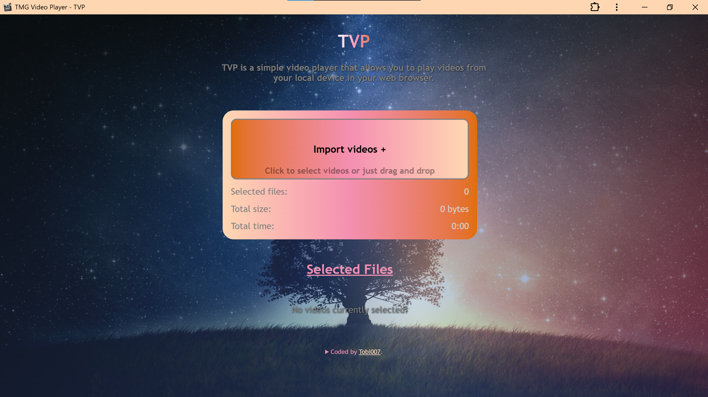
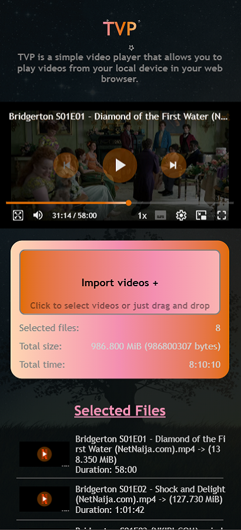

# TVP

### Table of contents

- [Project Developer](#project-developer)
- [Brief Description](#brief-description)
- [Visual Previews](#visual-previews)
- [More Info!](#more-info)
  - [Built With](#built-with)
  - [Links](#quick-links)

## Project Developer

- I am Oketade Oluwatobiloba, a Fullstack Developer in training. This is a website that uses the HTML5 Video Player of the Movie Garden to provide the best custom viewing experience out there. 

## Brief Description

The main idea here is for you to test out the custom controls of the video player while enjoying a movie or two. The actual TVP is in development and it will have a wide range of features like media libraries that you can build and edit, offline capabilities, picking back where you left off, a seamless user experience and a lot more. This is actually just an early prototype cooked up in bout 2 days but the video controls here has been in development for a while but just needs some field testing and they will be used in the real offline player so do well to give feedback, report bugs, request features or just criticize by sending me a mail. It is currently a single page website with a HTML5 custom  

### Visusal Previews

*Desktop view of the Page*

*Mobile view of the Page*

*Desktop view of the Video Player*

*Mobile view of the Video Player*

*Desktop view of the Video Player in Fullscreen*

*Mobile view of the Video Player in Fullscreen*

*Desktop view of the Video Player in Theater*

*Desktop Preview of the Video Player in Picture-in-picture*

*Mobile Preview of the Video Player in Picture-in-picture*

*Desktop Preview of the Video Mini-player*

*Mobile Preview of the Video Mini-player*

### More Info! 

### Built with

- HTML5 markup
- CSS custom properties
- JSON
- Super Responsive Workflow
- Vanilla Javascript

### Links
To view the live preview of this webpage, you can visit *[here][1]* or you can also visit *[here][2]* to view the github repository that houses this project

[1]: <https://tobi007-del.github.io/TMG_VIDEO_PLAYER/index.html>
"LIVE PREVIEW OF THE TASTEY WEBSITE"

[2]: <https://github.com/Tobi007-del/TMG_VIDEO_PLAYER>
"GITHUB REPOSITORY FOR THIS PROJECT"
